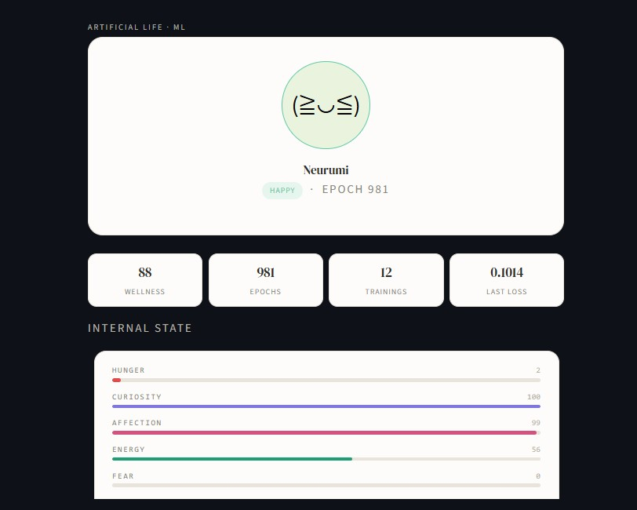
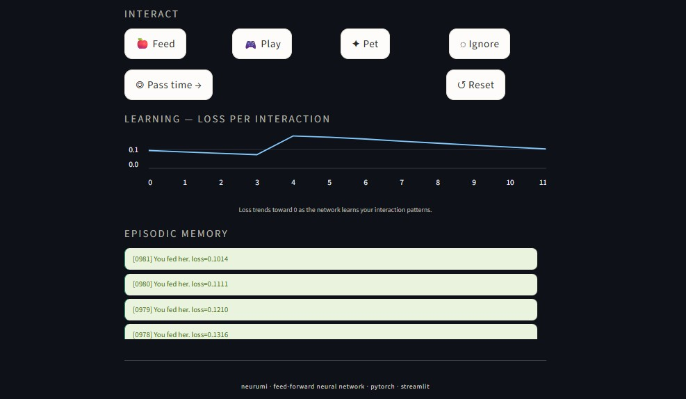

# NEURUMI — Artificial Life with Real ML

A digital creature that learns from your interactions using PyTorch.
Inspired by the Norns from *Creatures* (1996) and the Thronglets from *Black Mirror*.

<p align="center">
  
  
</p>

## Setup

```bash
# 1. Create a virtual environment
python -m venv venv
source venv/bin/activate       # Mac/Linux
# venv\Scripts\activate        # Windows

# 2. Install dependencies
pip install -r requirements.txt

# 3. Run
cd neurumi
streamlit run app.py
```

## Project structure

```
neurumi/
├── app.py           ← Streamlit UI
├── brain.py         ← Neural network (NeurumiBrain)
├── state.py         ← Internal state and drives (NeurumiState)
├── trainer.py       ← Training loop and inference
└── requirements.txt
```

## Generated files

These are created automatically as you interact with NEURUMI:

- `neurumi_state.json` — persisted creature state (drives, age, name)
- `neurumi_brain.pt`   — trained model weights

Use the `↺ Reset` button in the UI to start from scratch.

## How the ML works

Every time you interact (feed, play, pet, ignore):

1. The neural network receives the current state (5 drives) as a float32 tensor
2. It trains for 8 steps against the expected effect of your action
3. Loss decreases over time — the network learns your interaction patterns
4. When you press "Pass time", the network predicts on its own what should change next

### Network architecture

```
Input (5 drives) → Linear(5→16) + ReLU → Linear(16→8) + ReLU → Linear(8→5) + Tanh → Output (5 deltas)
```

### The 5 drives

| Drive | Description |
|-------|-------------|
| `hunger` | Increases over time. Feed NEURUMI to reduce it. |
| `curiosity` | Rises naturally. Playing satisfies it. |
| `affection` | Decays over time. Petting and playing restore it. |
| `energy` | Drains slowly. Resting and feeding restore it. |
| `fear` | Rises when ignored. Petting and playing reduce it. |

### Emotions

NEURUMI's current emotion is derived from the combination of her drives:

| Emotion | Trigger condition |
|---------|-------------------|
| Happy | affection > 0.78 |
| Calm | default state |
| Curious | curiosity > 0.82 |
| Hungry | hunger > 0.78 |
| Scared | fear > 0.65 |
| Sleepy | energy < 0.18 |
| Lonely | affection < 0.22 |

## Roadmap

- **Phase 1** *(current)* — Supervised learning: the network learns the expected effect of each action
- **Phase 2** — Q-Learning: NEURUMI discovers on her own which actions maximize her wellbeing
- **Phase 3** — Episodic memory: past events are encoded as embeddings and used as context for decisions